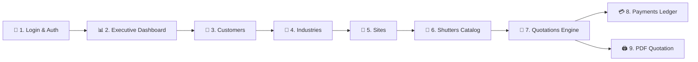
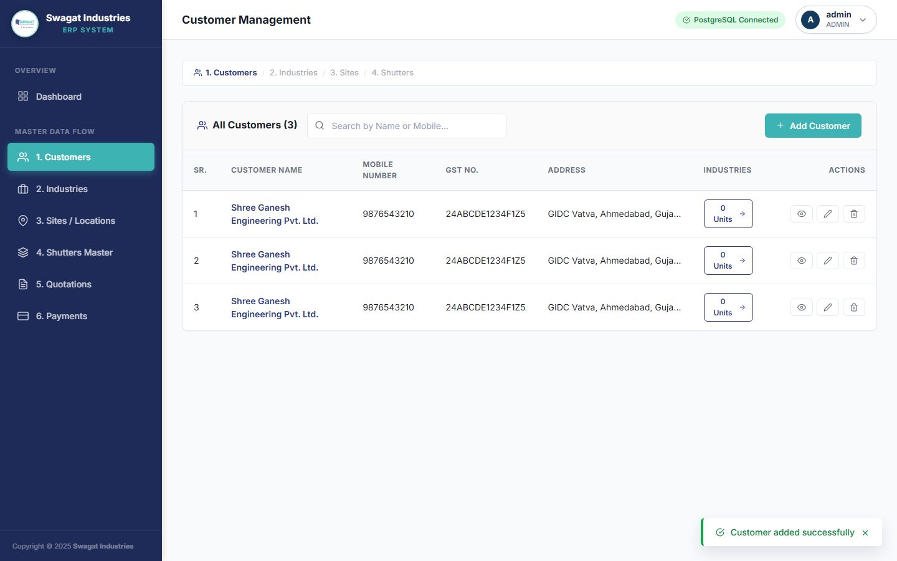
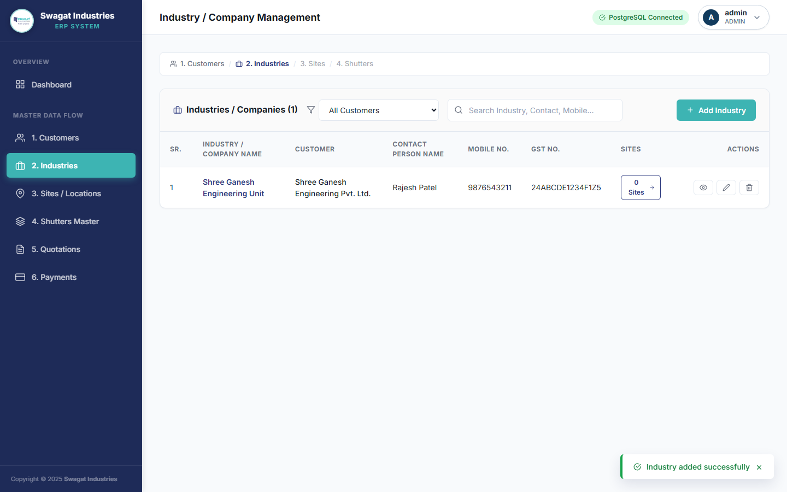
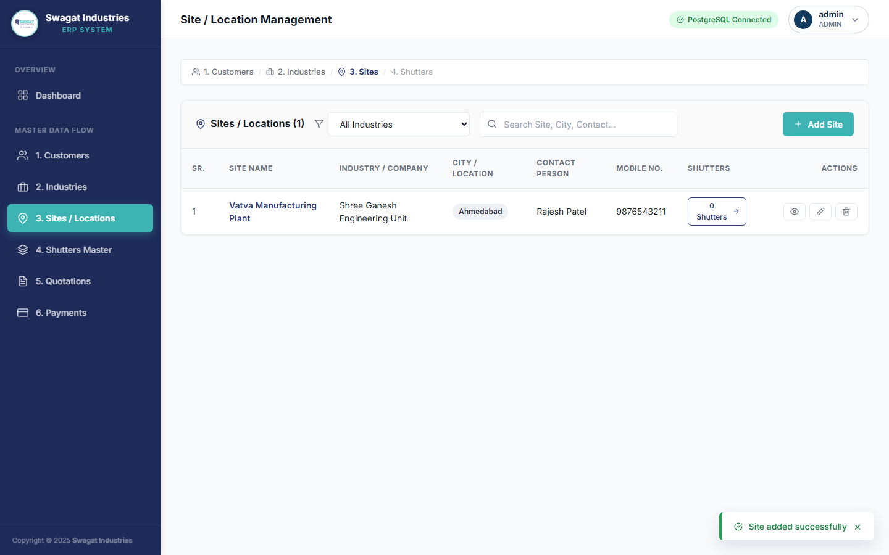
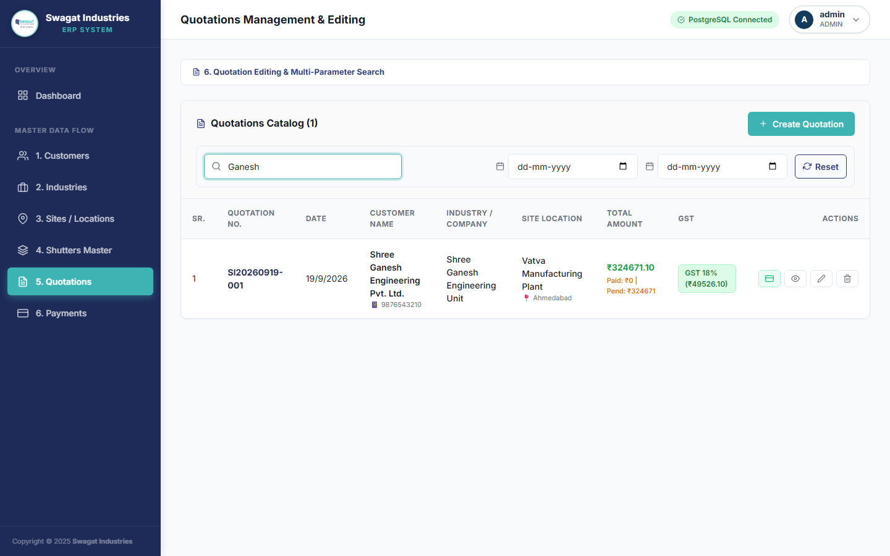
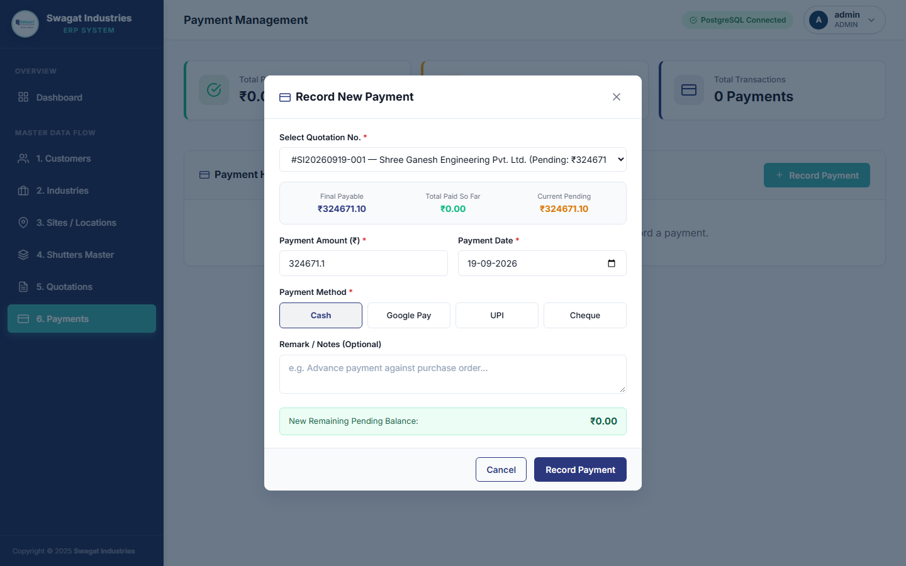
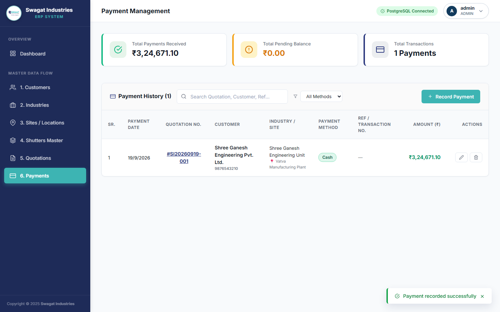
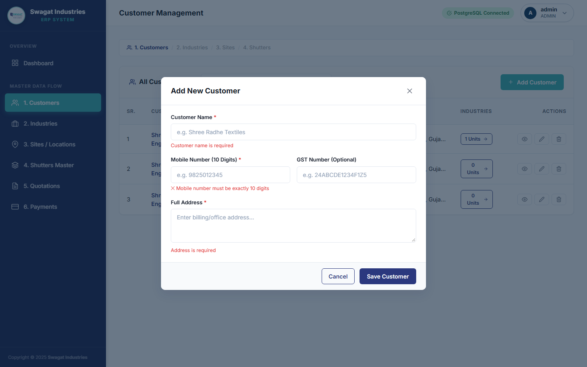

# 🏭 Swagat Industries ERP & Quotation Management System

A production-grade, full-stack Enterprise Resource Planning (ERP) and Quotation Management System tailored specifically for **Swagat Industries**, specializing in Rolling Shutter Manufacturing, Multi-Site Installation Tracking, Technical Dimension Math Engine, PDF Generation, and Payment Ledger Management.

---

## 📋 Overview & Purpose

Swagat Industries ERP streamlines end-to-end industrial manufacturing workflows from customer onboarding to quotation dispatch and payment reconciliation. The application enforces a strict hierarchical relational model:

$$\text{Customer} \longrightarrow \text{Industry / Company} \longrightarrow \text{Installation Site} \longrightarrow \text{Rolling Shutter Catalog} \longrightarrow \text{Quotation} \longrightarrow \text{Payments}$$

---

## 🔄 Complete Application Flow

The system guides administrators through an integrated operational workflow:



---

## 📸 Application Screenshots & Module Walkthrough

### 🔐 1. Authentication & Security (`01-auth/`)

The authentication and access control module features enterprise Swagat Industries branding, interactive canvas CAPTCHA challenge verification, JWT token persistence, bcrypt password hashing, automatic post-login dashboard navigation, and complete self-service password recovery workflows.

#### Features & Capabilities
- **Canvas CAPTCHA Verification**: Dynamic client-side graphical code generation preventing bot automated brute-force attacks.
- **Forgot Password & OTP Recovery**: Integrated email notification system dispatching 6-digit OTP verification codes via SMTP with 15-minute expiration timers.
- **Live Password Pre-Verification**: Real-time password check before allowing credential updates.
- **Always-Redirect Dashboard Navigation**: Preserved state navigation routing users directly to the Executive Dashboard upon successful authentication.

#### Login Screen
*Clean, enterprise login interface with username, password, interactive canvas CAPTCHA, password visibility toggle, and forgot password recovery link.*


#### Login Validation & Error Handling
*Real-time validation badges displaying error alerts for invalid credentials or incorrect CAPTCHA code.*


#### Forgot Password & OTP Recovery Modal
*Self-service password recovery wizard with username/email input, 6-digit OTP verification code, and secure password updating.*


---

### 📊 2. Executive Dashboard (`02-dashboard/`)

Centralized operational hub displaying entity KPI counters, financial summary cards, live PostgreSQL database health indicator, and recent quotation streams.

#### Executive Dashboard Overview
*Dashboard featuring 5 operational metrics (Customers, Industries, Sites, Shutters, Quotations), Total Billed Amount, Received Payments, and Outstanding Pending Balance.*


---

### 👥 3. Customer Management (`03-customers/`)

Centralized CRM module managing primary client profiles, contact numbers, billing addresses, and Indian GSTIN (15-character uppercase regex) keyup format validations.

#### Customers List View
*Searchable table listing customer profiles, mobile numbers, GST numbers, addresses, and linked industrial unit counts.*


#### Add Customer Modal
*Modal form for registering new customer profiles with real-time format validation indicators.*


#### Customer Form Data Entry
*Data entry form filled with test Gujarat customer details (`Shree Ganesh Engineering Pvt. Ltd.`).*


#### Customer Created
*Updated customer directory showcasing newly registered customer entity.*


#### Customer Details View Modal
*Detailed profile view modal displaying complete customer info, GSTIN status, and linked company units.*


---

### 🏢 4. Industry / Company Management (`04-industries/`)

Multi-level corporate client management linking industrial units and subsidiary accounts directly under parent customer records.

#### Industries Directory List
*Searchable table displaying industrial accounts, parent customer names, contact persons, and site counts.*


#### Add Industry Modal
*Cascading dropdown modal for registering industrial units (`Shree Ganesh Engineering Unit`).*


#### Industry Entity Created
*Updated industry list reflecting newly created company unit.*


---

### 📍 5. Site / Location Management (`05-sites/`)

Multi-location site tracking with city locations, site supervisors, contact numbers, installation remarks, and linked shutter catalog counts.

#### Sites List View
*Table displaying physical installation locations, city tags, site contacts, and shutter specifications.*


#### Add Site Modal
*Form modal for registering installation sites (`Vatva Manufacturing Plant`, Ahmedabad).*


#### Site Registered
*Directory listing displaying newly added installation site location.*


---

### 🚪 6. Rolling Shutters Master Catalog & Math Engine (`06-shutters/`)

Technical shutter catalog supporting custom Height & Width inputs in inches, automatic Sq.Ft calculations, fitting types (**A Type** Guide Inside / **B Type** Guide Outside), and drive mechanisms (**Manual**, **Gear**, **Motorised**).

#### Shutters Catalog List
*Master catalog table displaying shutter dimensions, converted feet, drive mechanism badges, rate per sq.ft, and calculated total basic price.*


#### Manual Shutter Specification
*Form modal specifying a Manual Shutter (`120" × 144"`, Height +1.50' & Width +0.50' allowances).*


#### Gear Shutter Specification
*Form modal specifying a Heavy Duty Gear Shutter (`144" × 180"`, Height +2.00' & Width +0.75' allowances, Gear Price ₹3,500).*


#### Motorised Shutter Specification
*Form modal specifying an Automated Motorised Shutter (`180" × 216"`, Motor Price ₹12,500).*


#### Live Shutter Calculation Preview
*Real-time live math calculation banner displaying Over Height, Over Width, Total Sq.Ft., GI Top Cover Size, Shutter Basic, and Item Basic Total.*


---

### 📜 7. Quotation Engine (`07-quotations/`)

Automated quotation generator featuring cascading customer-industry-site selection, shutter snapshots, additional charges, transportation fees, configurable GST rates (0% to 28%), and discount handling.

#### Quotations List View
*Table listing generated quotations, quotation numbers, dates, customer details, total amounts, paid amounts, and pending balances.*


#### Create Quotation Wizard
*Interactive quotation wizard with customer, industry, site dropdowns, and shutter item selection checkboxes.*


#### Live Financial Recalculation Summary
*Live financial computation panel showing Shutter Basic Total, GI Top Cover Total, Transportation, GST, and Final Total.*


#### View Quotation Modal
*Modal displaying full quotation line items, dimension math breakdowns, and financial summaries.*


#### Quotation Search & Filtering
*Search filter isolating quotation records by customer name or quotation number.*


---

### 💳 8. Payment Ledger & Balance Tracking (`08-payments/`)

Transaction ledger tracking advance payments, partial settlements, and full payments per quotation with multi-method support (**UPI**, **Cash**, **Cheque**, **Bank Transfer**, **Google Pay**), live balance recalculations, printable voucher slips, and WhatsApp receipt dispatching.

#### Features & Capabilities
- **Printable Payment Slip Generator (`PaymentSlipModal`)**: High-fidelity A4 printable receipt voucher featuring company branding, receipt sequence number (`REC-XXXXX`), payment transaction details, amount converted into Indian Rupee words (*e.g. Rupees Ten Thousand Only*), quotation breakdown, remaining balance status badge (*FULLY PAID* / *PARTIALLY PAID*), and signature blocks.
- **One-Click WhatsApp Receipt Sharing**: Generates formatted WhatsApp payment confirmations sent directly to customer mobile numbers.
- **Direct PDF & Print Export**: Integrated `@media print` layout ready for physical printing or PDF saving.

#### Payments List View
*Ledger table displaying payment dates, quotation numbers, payment methods, transaction reference numbers, received amounts, and action buttons for printing payment slips.*


#### Record Payment Modal
*Form modal for recording new payment transactions against active quotations.*


#### Payment History & Balance Recalculation
*Updated payment ledger displaying total collected revenue and automatically recalculated outstanding pending balances.*


#### Payment Receipt Slip Voucher Modal
*Official printable payment receipt voucher featuring Swagat Industries letterhead, unique receipt sequence number (`REC-XXXXX`), payment method details, amount converted into Indian Rupee words, quotation summary, remaining balance status badge, and one-click WhatsApp sharing.*


---

### 🏢 9. Company Settings & Terms (`09-settings/`)

Architecture managing company profile branding, GSTIN/PAN details, bank account info for invoice payments, and configurable PDF terms & conditions.

#### Company Settings & Terms Management
*Centralized company settings dashboard featuring company profile cards, bank details, and quotation terms clauses.*


---

### 🖨️ 10. Printable PDF Quotation (`10-pdf/`)

High-fidelity PDF preview modal incorporating Swagat Industries letterhead logo, customer details, shutter specification table, itemized financial summary, bank payment instructions, and terms & conditions footer.

#### Printable PDF Quotation Preview
*Clean, enterprise-formatted printable quotation preview featuring official letterhead, customer profile, site specifications, shutter line-item dimension math, tax summary, bank payment instructions, and terms & conditions clauses ready for browser printing or client PDF download.*


---

### 🛠️ 11. Real-Time Field Validations (`11-validation/`)

Strict client-side and server-side input validation enforcing required fields, positive dimension values, 10-digit mobile numbers, and 15-character uppercase Indian GSTIN format.

#### Field Validation Badges
*Form displaying dynamic red alert error messages for missing or invalid form input fields.*


---

## 🧮 Quotation Financial Calculation Engine Math

The calculation engine follows strict mathematical formulas across real-time frontend recalculations, backend controllers, and printable PDF documents:

### 1. Dimension & Conversion Formulas
$$\text{Height (ft)} = \text{ROUND}\left(\frac{\text{Height (inches)}}{12}, 2\right)$$
$$\text{Width (ft)} = \text{ROUND}\left(\frac{\text{Width (inches)}}{12}, 2\right)$$

### 2. Drive Mechanism & Allowance Math
- **Manual Shutter**:
  $$\text{Over Height} = \text{Height (ft)} + 1.50$$
  $$\text{Over Width} = \text{Width (ft)} + 0.50$$
  $$\text{Cover Size (R.Ft)} = \text{Over Width} + 0.50$$
- **Gear / Motorised Shutter**:
  $$\text{Over Height} = \text{Height (ft)} + 2.00$$
  $$\text{Over Width} = \text{Width (ft)} + 0.75$$
  $$\text{Cover Size (R.Ft)} = \text{Over Width} + 0.75$$

### 3. Shutter Item Basic Math
$$\text{Total Sq.Ft} = \text{Over Height} \times \text{Over Width}$$
$$\text{Basic Total (No Cover)} = (\text{Total Sq.Ft} \times \text{Rate/Sqft}) + \text{Gear Price} + \text{Motor Price}$$
$$\text{GI Cover Total} = \text{Cover Size (R.Ft)} \times \text{GI Cover Rate/Sqft}$$
$$\text{Shutter Price (Basic + Cover)} = \text{Basic Total (No Cover)} + \text{GI Cover Total}$$

### 4. Quotation Financial Summary Math
$$\text{Shutter Basic Total} = \sum \text{Shutter Price (Basic + Cover)}$$
$$\text{Total Basic (GST Base)} = \text{Shutter Basic Total} + \text{Transportation Charges} + \text{Additional Charges} - \text{Discount Amount}$$
$$\text{GST Amount} = \text{Total Basic} \times \left(\frac{\text{GST \%}}{100}\right) \quad \text{(if GST Applicable)}$$
$$\text{Final Total (Incl. GST)} = \text{Total Basic} + \text{GST Amount}$$
$$\text{Outstanding Pending Balance} = \text{Final Total} - \sum \text{Recorded Payments}$$

---

## 🛠️ Technology Stack

### Frontend (`/FE`)
- **Framework**: React 18 (`v18.3.1`) + Vite 6 (`v6.0.7`)
- **Styling**: Bootstrap 5 (`v5.3.3`) + Custom CSS Variables & Animations
- **Icons**: React Icons (`fi` Feather Icons `v5.4.0`)
- **Routing**: React Router DOM (`v6.28.1`)
- **State & Toast**: React Context API (`AuthContext`, `ToastContext`)

### Backend (`/BE`)
- **Runtime**: Node.js (`v18+`) + Express.js (`v4.21.2`)
- **Database**: PostgreSQL (`v14+`)
- **ORM**: Prisma ORM (`v6.4.1`)
- **Security & Auth**: JSON Web Tokens (`jsonwebtoken v9.0.3`) & `bcryptjs` (`v3.0.3`)
- **Email & Mailer System**: Nodemailer (`v6.10.0`) for SMTP OTP delivery with HTML branding templates
- **Environment**: Dotenv (`v16.4.7`) & CORS (`v2.8.5`)

---

## 🔌 REST API Endpoints

| Module | Method | Endpoint | Description | Auth Required |
| :--- | :--- | :--- | :--- | :---: |
| **Auth** | `POST` | `/api/auth/login` | Authenticate admin user & issue JWT token | ❌ |
| **Auth** | `POST` | `/api/auth/forgot-password` | Request 6-digit password reset OTP email | ❌ |
| **Auth** | `POST` | `/api/auth/verify-otp` | Verify password reset 6-digit OTP code | ❌ |
| **Auth** | `POST` | `/api/auth/reset-password` | Reset account password using verified OTP | ❌ |
| **Auth** | `GET` | `/api/auth/me` | Fetch authenticated admin profile | 🟢 |
| **Auth** | `POST` | `/api/auth/logout` | Revoke session & perform admin logout | 🟢 |
| **Auth** | `POST` | `/api/auth/verify-current-password` | Live verification of current password | 🟢 |
| **Auth** | `POST` | `/api/auth/change-password` | Update current user password | 🟢 |
| **Dashboard** | `GET` | `/api/dashboard` | Retrieve operational & financial KPI metrics | 🟢 |
| **Customers** | `GET` | `/api/customers` | Fetch all customer records | 🟢 |
| **Customers** | `POST` | `/api/customers` | Create new customer profile | 🟢 |
| **Customers** | `GET / PUT / DELETE` | `/api/customers/:id` | View, update, or remove customer | 🟢 |
| **Industries** | `GET` | `/api/industries` | Fetch industrial corporate accounts | 🟢 |
| **Industries** | `POST` | `/api/industries` | Create new industrial corporate entity | 🟢 |
| **Industries** | `GET / PUT / DELETE` | `/api/industries/:id` | View, update, or remove industry | 🟢 |
| **Sites** | `GET` | `/api/sites` | Fetch installation site locations | 🟢 |
| **Sites** | `POST` | `/api/sites` | Create new installation site | 🟢 |
| **Sites** | `GET / PUT / DELETE` | `/api/sites/:id` | View, update, or remove site | 🟢 |
| **Shutters** | `GET` | `/api/shutters` | Fetch shutter master catalog | 🟢 |
| **Shutters** | `POST` | `/api/shutters` | Create new shutter specification | 🟢 |
| **Shutters** | `GET / PUT / DELETE` | `/api/shutters/:id` | View, update, or remove shutter spec | 🟢 |
| **Quotations** | `GET` | `/api/quotations` | Fetch quotations list | 🟢 |
| **Quotations** | `POST` | `/api/quotations` | Create new quotation record | 🟢 |
| **Quotations** | `GET / PUT / DELETE` | `/api/quotations/:id` | View detail, update, or delete quotation | 🟢 |
| **Payments** | `GET` | `/api/payments` | Fetch payment transactions ledger | 🟢 |
| **Payments** | `POST` | `/api/payments` | Record payment against quotation | 🟢 |
| **Payments** | `GET` | `/api/payments/:id` | Fetch full payment detail & quotation balance for receipt slip | 🟢 |
| **Payments** | `PUT / DELETE` | `/api/payments/:id` | Update or delete payment transaction | 🟢 |
| **Company Settings** | `GET / PUT` | `/api/company-settings` | Fetch or update company profile & bank details | 🟢 |
| **Quotation Terms** | `GET / POST` | `/api/quotation-terms` | Fetch or create quotation terms clauses | 🟢 |
| **Quotation Terms** | `PUT / DELETE` | `/api/quotation-terms/:id` | Update or delete quotation term clause | 🟢 |
| **Health Check** | `GET` | `/api/health` | Health check & PostgreSQL DB status | ❌ |

---

## 📊 Database Schema Overview

The application utilizes **Prisma ORM** connected to **PostgreSQL** with 11 relational models:

| Model | Table Name | Purpose | Key Relationships |
| :--- | :--- | :--- | :--- |
| `User` | `users` | Administrator accounts & JWT auth | — |
| `Customer` | `customers` | Primary customer profiles & GSTIN | Has many `Industry`, `Quotation` |
| `Industry` | `industries` | Corporate client entities | Belongs to `Customer`, Has many `Site`, `Quotation` |
| `Site` | `sites` | Physical installation locations | Belongs to `Industry`, Has many `Shutter`, `Quotation` |
| `Shutter` | `shutters` | Master shutter catalog per site | Belongs to `Site`, Has many `QuotationItem` |
| `Quotation` | `quotations` | Quotation header & financial summary | Belongs to `Customer`, `Industry`, `Site`; Has many `QuotationItem`, `AdditionalCharge`, `Payment` |
| `QuotationItem` | `quotation_items` | Snapshot of shutter specs per quotation | Belongs to `Quotation`, `Shutter` |
| `AdditionalCharge` | `additional_charges` | Line items for custom charges | Belongs to `Quotation` |
| `Payment` | `payments` | Transaction ledger for payments | Belongs to `Quotation` |
| `CompanySetting` | `company_settings` | Business profile & banking details | — |
| `QuotationTerm` | `quotation_terms` | Terms & conditions clauses for PDF | — |

---

## 📁 Project Repository Structure

```text
Swagat-Industries-ERP-System/
├── FE/                             # Frontend Application (React 18 + Vite 6)
│   ├── public/                     # Static Assets & Screenshots
│   │   ├── logo.png                # Brand Logo
│   │   └── screenshots/            # Showcase UI Screenshots
│   │       ├── 01-auth/            # Login & Validation Screenshots
│   │       ├── 02-dashboard/       # Executive Dashboard Screenshot
│   │       ├── 03-customers/       # Customer Management Screenshots
│   │       ├── 04-industries/      # Corporate Industry Directory Screenshots
│   │       ├── 05-sites/           # Installation Sites Screenshots
│   │       ├── 06-shutters/        # Shutters Catalog & Math Screenshots
│   │       ├── 07-quotations/      # Quotations Engine Screenshots
│   │       ├── 08-payments/        # Payments Ledger Screenshots
│   │       ├── 09-settings/        # Company Settings & Terms Screenshots
│   │       ├── 10-pdf/             # Printable PDF Preview Screenshot
│   │       └── 11-validation/      # Form Validation Badges Screenshot
│   ├── src/
│   │   ├── components/             # Auth, Layout (Navbar, Sidebar), UI Modals
│   │   ├── context/                # AuthContext & ToastContext Providers
│   │   ├── pages/                  # Dashboard, Customers, Industries, Sites, Shutters, Quotations, Payments, Settings, Login
│   │   ├── services/               # API Service Layer (`api.js`)
│   │   ├── styles/                 # Theme CSS, Variables & Component Styles
│   │   ├── utils/                  # Input Validation & Format Helpers
│   │   ├── App.jsx                 # Routes & Context Providers
│   │   └── main.jsx                # React Entry Point
│   ├── package.json
│   └── vite.config.js
│
├── BE/                             # Backend API Server (Node.js + Express + Prisma)
│   ├── prisma/                     # Database ORM Configuration
│   │   ├── schema.prisma           # PostgreSQL Relational Models
│   │   └── seed.js                 # Admin User & Initial Configuration Seeding
│   ├── src/
│   │   ├── config/                 # Prisma DB Connection Setup (`db.js`)
│   │   ├── controllers/            # Controller Handlers for all ERP Modules
│   │   ├── middlewares/            # JWT Auth & Error Handling Middleware
│   │   ├── routes/                 # Express API Router Modules
│   │   ├── utils/                  # Financial Math Engine & Response Handlers
│   │   ├── app.js                  # Express App Setup & Middleware Configuration
│   │   └── server.js               # Backend Server Entry Point
│   ├── .env                    # Environment Configuration
│   └── package.json
│
├── errors.md                       # Comprehensive Testing & Error Audit Log
└── README.md                       # Main Project Documentation
```

---

## 🚀 Installation & Running Guide

### Prerequisites
- **Node.js** (v18.x or higher)
- **npm** (v9.x or higher)
- **PostgreSQL** Database Server (v14.x or higher)

### 1. Backend Setup (`/BE`)
```bash
cd BE
npm install
npm run prisma:migrate
npm run prisma:generate
npm run prisma:seed
npm run dev
```
Backend API will start on `http://localhost:5000`.

### 2. Frontend Setup (`/FE`)
```bash
cd FE
npm install
npm run dev
```
Frontend Vite server will start on `http://localhost:3000`.

---

## 🧪 Testing & Verification

During browser-based functional testing via Python Playwright automation, all dummy business data was entered **exclusively through the frontend user interface**:

- **Real Browser Automation**: Tested via Chromium browser on `http://localhost:3000`.
- **UI Data Entry**: 100% of customers, industries, sites, shutter specifications, quotations, and payments were created via frontend form modals.
- **Validation Testing**: Verified required fields, mobile number format, GSTIN 15-character uppercase format, and numeric input boundaries.
- **Error Audit Log**: Detailed testing logs and error audit details are documented separately in [errors.md](./errors.md).

---

## 📝 License

This software is proprietary and confidential. Developed specifically for **Swagat Industries**.  
All rights reserved.
